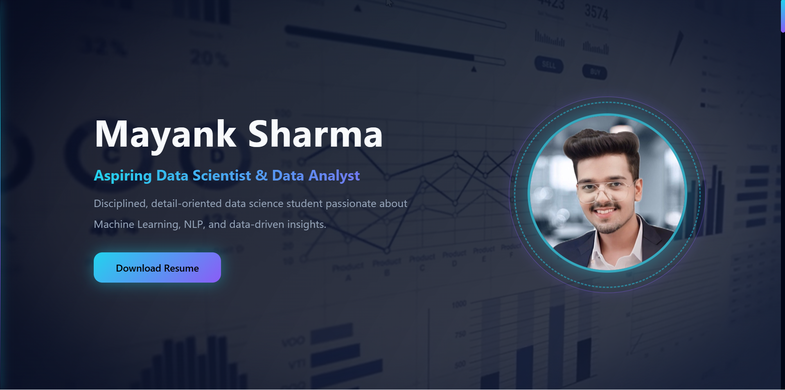

# 👋 Hey, I’m Mayank Sharma  
### 📊 Data Science • 🤖 Machine Learning • 🚀 Project-Driven Learning

🌐 **Live Portfolio Website**  
👉 https://mayanksharma-ds.github.io/

⭐ If you like this portfolio, consider starring the repo!

---

## 👀 Portfolio Preview

  

> A quick visual preview of my personal portfolio website built using GitHub Pages.

---

## 🌟 Introduction

Welcome to my **personal portfolio website repository**.

This site is built using **GitHub Pages** and represents:
- who I am  
- what I build  
- how I apply data science concepts in real projects  

Instead of just saying *“I know Data Science”*,  
this portfolio **shows my work, code, and thinking**.

---

## 🎯 Purpose of This Portfolio

I built this portfolio to:

✅ Go beyond a traditional resume  
✅ Showcase **real, hands-on projects**  
✅ Share my learning journey publicly  
✅ Create a single place for recruiters & learners to explore my work  

> 📌 This portfolio evolves as I grow — new projects, better code, better ideas.

---

## 🎥 Portfolio Video Walkthrough

I’ve created a short **video walkthrough** explaining:
- the structure of my portfolio  
- featured projects  
- my skills and tools  

▶️ **Watch the video walkthrough:**  
[🎬 Click here to watch](portfolio_video.mp4)

---

## 🧠 What’s Inside the Portfolio?

### 🚀 Featured Projects

🔹 **🚗 Car Price Prediction**
- Machine learning model to predict car prices
- Uses real-world features like brand, year, mileage
- End-to-end pipeline: data → model → deployment
- Built with **Python & scikit-learn**
- Deployed using **Streamlit**

🔹 **🧠 Text / Emotion Classification**
- NLP-based classification project
- Uses **TF-IDF & CountVectorizer**
- Focus on real-world text analysis problems

👉 Each project includes:
- source code  
- explanation  
- GitHub repository links  
- live demos (where available)

---

## 🛠️ Skills & Technologies

### 💻 Programming & Data
- Python  
- Pandas, NumPy  

### 🤖 Machine Learning
- Scikit-learn  
- Feature engineering & model evaluation  

### 🧠 Natural Language Processing
- TF-IDF  
- CountVectorizer  

### 📊 Visualization
- Matplotlib  
- Seaborn  

### 🚀 Deployment & Tools
- Streamlit  
- GitHub Pages  
- Git & GitHub  

---

## ⚙️ Tech Stack Overview

| Category | Tools |
|--------|------|
| Language | Python |
| Data Analysis | Pandas, NumPy |
| Machine Learning | Scikit-learn |
| NLP | TF-IDF, CountVectorizer |
| Visualization | Matplotlib, Seaborn |
| Deployment | Streamlit, GitHub Pages |
| Version Control | Git, GitHub |

---

